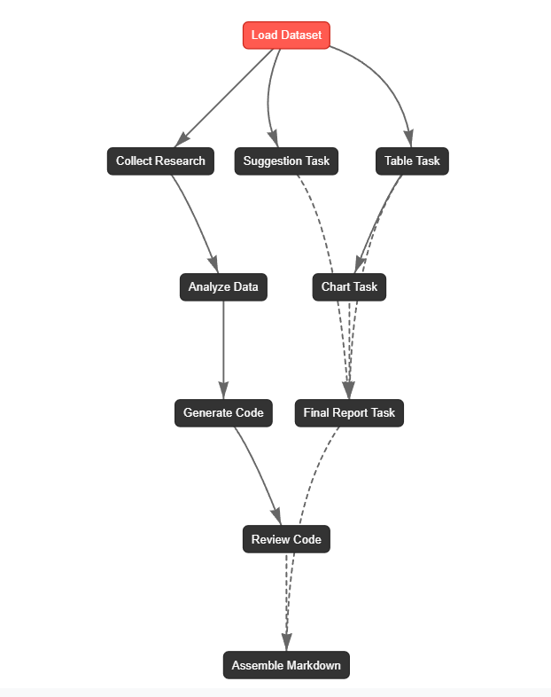

# Loan Prediction System – Multi-Agent & Machine Learning

This repository integrates **multi-agent systems** and **machine learning models** to analyze, preprocess, and predict credit risk based on consumer loan datasets.  

It consists of two complementary parts:  

- **Part 1**: Multi-agent pipeline for dataset analysis, reporting, and code generation.  
- **Part 2**: Machine learning pipeline for model training, evaluation, and prediction.  

---

## 📑 Table of Contents
- [Part 1 – MultiAgent Loan Prediction System](#part-1--multiagent-loan-prediction-system)  
  - [Overview](#-overview)  
  - [Project Structure](#-project-structure)  
  - [Key Components](#️-key-components)  
  - [Workflow](#-workflow)  
  - [Example Report](#-example-report)  
- [Part 2 – Loan Prediction Using ML](#part-2--loan-prediction-using-ml)  
  - [Introduction](#-introduction)  
  - [About the Data](#-about-the-data)  
  - [Project Structure](#-project-structure-1)  
  - [Libraries Used](#-libraries-used)  
  - [Steps Involved](#-steps-involved)  
  - [Results](#-results)  
  - [Future Work](#-future-work)  
- [Authors & Contact](#-authors)  

---

## 📂 Project Structure

```text
├── Refer
├── MultiAgent_LoanPredictionSystem.ipynb (Part 1)
├── LoanPrediction_Dataset
│ ├── Training Data.csv
│ ├── Test Data.csv
├── artifacts/
│ ├── csv_summary.json
│ ├── knowledge_package.json
│ ├── pipeline_plan.json
│ ├── generated_code.json
│ ├── review_report.json
│ ├── table_data.json
│ ├── charts_info.json
│ ├── final_report.json
│ └── final_report.md
├── LoanPrediction_FinalProjectML.ipynb (Part 2)
└── README.md
```

---

# Part 1 – MultiAgent Loan Prediction System  

## 🔎 Overview
This part implements a **multi-agent system** for credit risk dataset preprocessing, code generation, and reporting using **CrewAI**.  

Agents collaborate across two branches:  

- **Branch A (Data Engineering):** research → analysis → code generation → review  
- **Branch B (Reporting):** tables → charts → suggestions → final report  

Finally, both branches merge into a **Markdown report** for stakeholders.  

---

## ⚙️ Key Components

### CSV Summarization  
- Extracts safe metadata (columns, dtypes, missing values, samples, class balance).  

### Agents  
- **Research Agent** – collects best practices  
- **Analyst Agent** – designs pipeline plan  
- **Engineer Agent** – generates preprocessing code  
- **Reviewer Agent** – checks code correctness  
- **Suggestion Agent** – proposes improvements  
- **Reporting Agent** – assembles tables & report  
- **Chart Agent** – generates visualization metadata  

### Tasks & Schemas  
- Each task validates outputs with **Pydantic models** (PipelinePlan, GeneratedCode, FinalReport …).  
- JSON outputs are stored in `artifacts/`.  

### Final Report  
- Combines knowledge package, plan, code previews, review, tables, charts, and suggestions.  

---

## 🚀 Workflow

- **Branch A:** Research → Analysis → Generate Code → Review  
- **Branch B:** Tables → Charts → Suggestions → Report  
- **Merge:** Assemble unified `final_report.md`  


---

## 📑 Example Report
The generated report includes:  

- Pipeline plan with rationale  
- Python/YAML code snippets  
- Code review findings  
- Dataset tables & visualizations  
- Actionable data quality suggestions  
- Executive summary  

---

## Libraries Used
The following libraries are used in this part:

- numpy
- pandas
- typing
- matplotlib
- pydantic
- crewai
- json

---

# Part 2 – Loan Prediction Using ML  

## 📘 Introduction
This part develops **machine learning models** to predict which customers are at risk of defaulting on consumer loans.  

Using historical data, the goal is to **identify high-risk customers early** to support decision-making.  

---

## About the Data
The dataset contains the following features:

- ID: Unique identifier for each user.
- Income: User's income.
- Age: User's age.
- Experience: User's professional experience in years.
- Profession: User's profession.
- Married/Single: User's marital status.
- House_Ownership: Whether the user owns a house, rents, or has no house ownership.
- Car_Ownership: Whether the user owns a car.
- STATE: User's state or territory of residence.
- CITY: User's city or area of residence.
- CURRENT_JOB_YRS: Number of years the user has been working at their current job.
- CURRENT_HOUSE_YRS: Number of years the user has been living at their current address.
- Risk_Flag: Target variable indicating whether the user has defaulted (1) or not (0).

---

## Libraries Used
The following libraries are used in this part:

- numpy
- pandas
- seaborn
- matplotlib
- scipy
- imblearn
- scikit-learn

---

## 🔧 Steps Involved
1. **Data Exploration** – understand dataset, visualize distributions, detect issues  
2. **Data Preprocessing** – handle missing values, encode categorical vars, scale features, balance classes  
3. **Feature Engineering** – apply PCA for dimensionality reduction  
4. **Modeling** – train ML models (LogReg, KNN, RandomForest, AdaBoost, GradientBoosting, Naive Bayes, ANN)  
5. **Evaluation** – assess with accuracy, precision, recall, F1-score, ROC-AUC  

---

## 📊 Results
- Performance comparison across models  
- Confusion matrix, classification report  
- ROC curves & AUC scores  

---

## Future Work
Potential improvements and further work include:

- Experimenting with additional machine learning algorithms.
- Fine-tuning hyperparameters for better model performance.
- Exploring additional features or external data sources to enhance the model.

## Author

- Nguyễn Văn Hào (Part 2)
- Đặng Kim Thành (Part 1 + 2)
  
## Contact us

- Contact me via email: dangkimthanh281003@gmail.com
